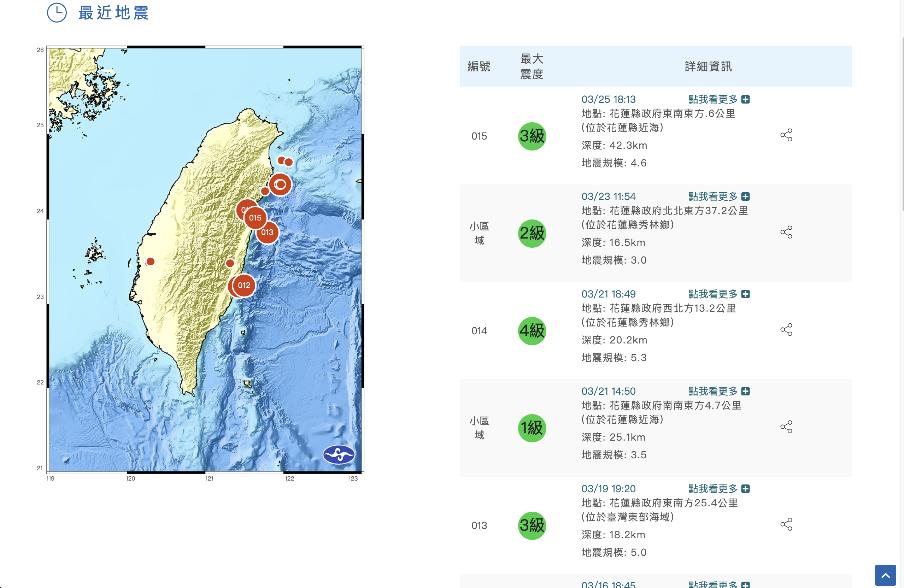

# Selenium Web Scrapping
## Website: https://www.cwa.gov.tw/V8/C/E/index.html
 

### Motivation:
#### I have developed a program that automatically scrapes an earthquake monitoring website every 5 minutes. This allows me to stay updated on earthquake occurrences.

### Selenium:

**I chose Selenium over Scrapy for this project because I am targeting only one website, which means the volume of data to process is manageable.**
